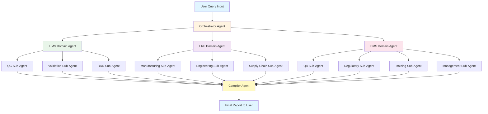
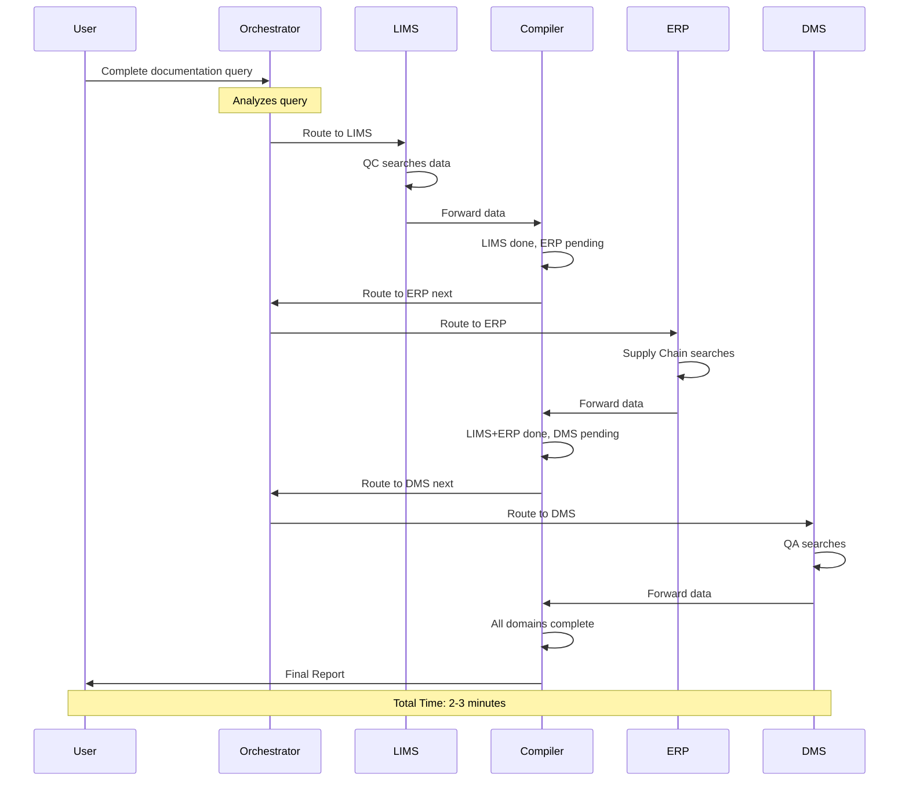
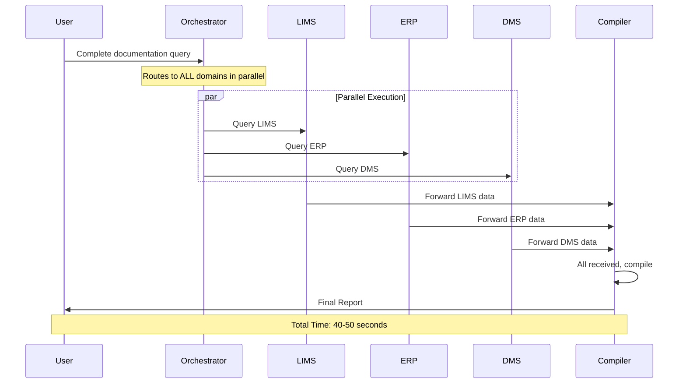
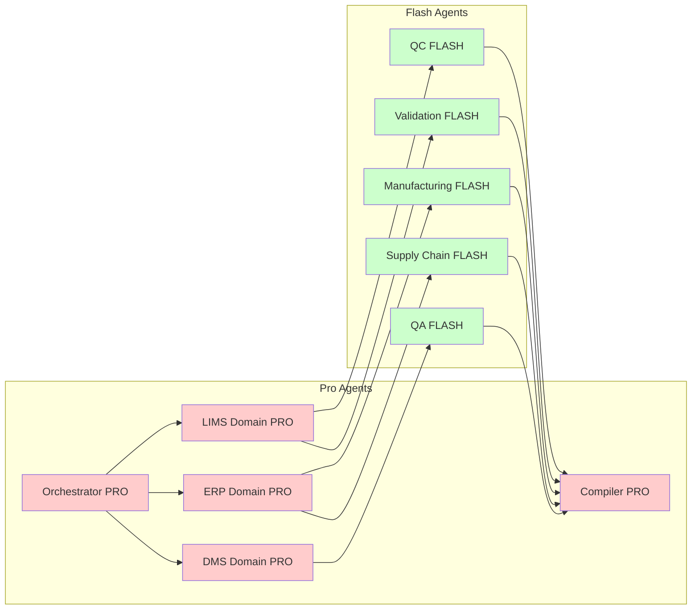
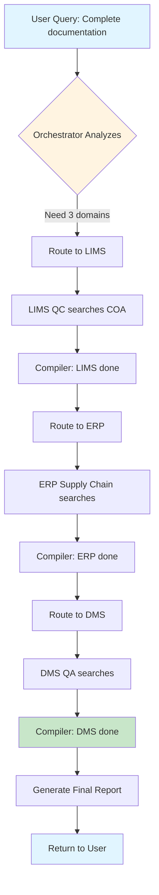
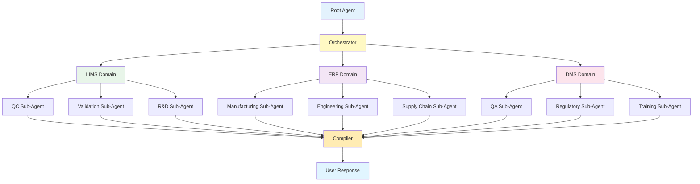
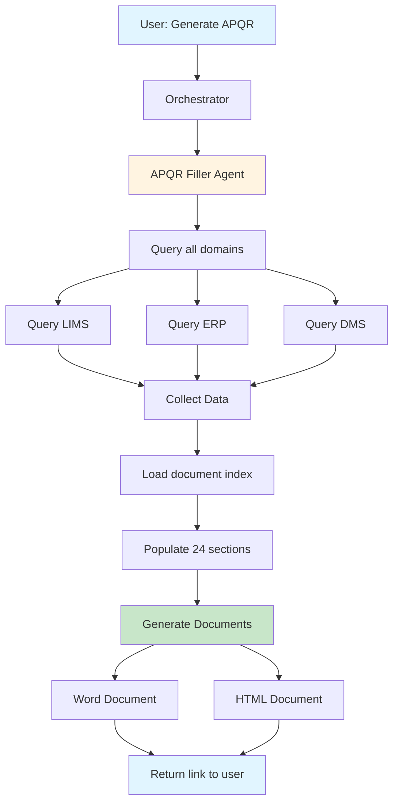
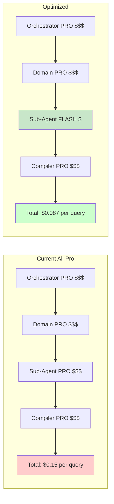

# APQR System Flowcharts (Mermaid 8.8.0 Compatible)

This file contains Mermaid.js diagrams compatible with older versions.

**Recommended: Use Mermaid Live Editor**
1. Visit: https://mermaid.live/
2. Copy any diagram code below
3. Paste into editor (renders automatically)
4. Export as PNG/SVG

**OR Update VS Code Extension:**
- Install "Markdown Preview Mermaid Support" (latest version)
- Restart VS Code

---

## 1. High-Level System Architecture



---

## 2. Sequential Workflow (Current System)



---

## 3. Async Workflow (Future)



---

## 4. Model Selection Architecture



---

## 5. Simple Data Flow



---

## 6. Agent Hierarchy (Simplified)



---

## 7. APQR Generation Flow



---

## 8. Cost Comparison



---

## How to View These Diagrams

### Option 1: Mermaid Live Editor (EASIEST)
1. Go to https://mermaid.live/
2. Copy any diagram code above (between ```mermaid and ```)
3. Paste into the editor
4. Diagram renders automatically
5. Click "Export PNG" or "Export SVG"

### Option 2: VS Code Extension
1. Open Extensions (Cmd+Shift+X or Ctrl+Shift+X)
2. Search "Markdown Preview Mermaid Support"
3. Install the extension by Matt Bierner
4. Restart VS Code
5. Open this file and click Preview button

### Option 3: GitHub
1. Push this file to GitHub
2. View the .md file on GitHub
3. Diagrams render automatically

---

## Troubleshooting

**If diagrams still don't render:**
- Your Mermaid version is too old
- Use Mermaid Live Editor (no installation needed)
- Or update your markdown viewer extension

**Syntax Errors:**
- Make sure to copy the ENTIRE code block including ```mermaid and closing ```
- Don't add extra spaces or lines

---

*Last Updated: November 12, 2025*
*Compatible with Mermaid 8.8.0+*

