# APQR System Flowcharts

This file contains Mermaid.js diagram code that can be rendered into visual flowcharts.

**How to use:**
1. Copy the code blocks below
2. Paste into [Mermaid Live Editor](https://mermaid.live/)
3. Export as PNG/SVG
4. Save images to assets/ folder

---

## 1. High-Level System Architecture

```mermaid
graph TB
    User[👤 User<br/>Query Input] --> Orchestrator[🎯 Orchestrator Agent<br/>Query Analysis & Routing]
    
    Orchestrator --> LIMS[🔬 LIMS Domain<br/>Laboratory Data]
    Orchestrator --> ERP[🏭 ERP Domain<br/>Manufacturing & Supply]
    Orchestrator --> DMS[📋 DMS Domain<br/>Quality Documents]
    
    LIMS --> QC[QC Sub-Agent]
    LIMS --> Validation[Validation Sub-Agent]
    LIMS --> RnD[R&D Sub-Agent]
    
    ERP --> Manufacturing[Manufacturing Sub-Agent]
    ERP --> Engineering[Engineering Sub-Agent]
    ERP --> SupplyChain[Supply Chain Sub-Agent]
    
    DMS --> QA[QA Sub-Agent]
    DMS --> Regulatory[Regulatory Sub-Agent]
    DMS --> Training[Training Sub-Agent]
    DMS --> Management[Management Sub-Agent]
    
    QC --> Compiler[📊 Compiler Agent<br/>Data Synthesis]
    Validation --> Compiler
    RnD --> Compiler
    Manufacturing --> Compiler
    Engineering --> Compiler
    SupplyChain --> Compiler
    QA --> Compiler
    Regulatory --> Compiler
    Training --> Compiler
    Management --> Compiler
    
    Compiler --> FinalReport[📄 Final Report<br/>to User]
    
    style User fill:#e1f5ff
    style Orchestrator fill:#fff4e1
    style LIMS fill:#e8f5e9
    style ERP fill:#f3e5f5
    style DMS fill:#fce4ec
    style Compiler fill:#fff9c4
    style FinalReport fill:#e1f5ff
```

---

## 2. Sequential Workflow (Current System)

```mermaid
sequenceDiagram
    participant User
    participant Orchestrator
    participant LIMS
    participant Compiler
    participant ERP
    participant DMS
    
    User->>Orchestrator: "Complete documentation for API"
    
    Note over Orchestrator: Analyzes: Need LIMS + ERP + DMS
    
    Orchestrator->>LIMS: Route to LIMS Domain
    activate LIMS
    LIMS->>LIMS: QC Sub-Agent searches COA
    LIMS->>Compiler: Forward COA data
    deactivate LIMS
    
    activate Compiler
    Compiler->>Compiler: ✅ LIMS done<br/>⏳ ERP pending<br/>⏳ DMS pending
    Compiler->>Orchestrator: "Need ERP & DMS. Route next."
    deactivate Compiler
    
    Orchestrator->>ERP: Route to ERP Domain
    activate ERP
    ERP->>ERP: Supply Chain searches PO/SDS
    ERP->>Compiler: Forward procurement data
    deactivate ERP
    
    activate Compiler
    Compiler->>Compiler: ✅ LIMS done<br/>✅ ERP done<br/>⏳ DMS pending
    Compiler->>Orchestrator: "Need DMS. Route next."
    deactivate Compiler
    
    Orchestrator->>DMS: Route to DMS Domain
    activate DMS
    DMS->>DMS: QA searches deviations
    DMS->>Compiler: Forward QA data
    deactivate DMS
    
    activate Compiler
    Compiler->>Compiler: ✅ All 3 domains complete!<br/>Generate final report
    Compiler->>User: 📄 Comprehensive Report
    deactivate Compiler
    
    Note over User,DMS: Total Time: ~2-3 minutes
```

---

## 3. Async Workflow (Future Enhancement)

```mermaid
sequenceDiagram
    participant User
    participant Orchestrator
    participant LIMS
    participant ERP
    participant DMS
    participant Compiler
    
    User->>Orchestrator: "Complete documentation for API"
    
    Note over Orchestrator: Analyzes: Need LIMS + ERP + DMS
    Note over Orchestrator: Routes to ALL 3 in parallel
    
    par Parallel Execution
        Orchestrator->>LIMS: Route to LIMS
        and
        Orchestrator->>ERP: Route to ERP
        and
        Orchestrator->>DMS: Route to DMS
    end
    
    activate LIMS
    activate ERP
    activate DMS
    
    LIMS->>LIMS: QC searches COA
    ERP->>ERP: Supply Chain searches PO/SDS
    DMS->>DMS: QA searches deviations
    
    LIMS->>Compiler: Forward COA data
    deactivate LIMS
    ERP->>Compiler: Forward procurement data
    deactivate ERP
    DMS->>Compiler: Forward QA data
    deactivate DMS
    
    activate Compiler
    Compiler->>Compiler: ✅ All 3 received!<br/>Generate final report
    Compiler->>User: 📄 Comprehensive Report
    deactivate Compiler
    
    Note over User,Compiler: Total Time: ~40-50 seconds (67% faster!)
```

---

## 4. Model Selection Architecture (Flash vs Pro)

---

## 5. Data Flow Example: Complete Documentation Query

```mermaid
flowchart TD
    Start([👤 User Query:<br/>Complete documentation for Disintegrant])
    
    Start --> OrcA{🎯 Orchestrator:<br/>Analyze Query}
    OrcA -->|Detects: LIMS + ERP + DMS| Step1[Route to LIMS Domain]
    
    Step1 --> LIMSQC[🔬 LIMS QC Sub-Agent<br/>Search COA files]
    LIMSQC --> LIMSD{Found COA?}
    LIMSD -->|Yes| LIMSC[Extract assay results]
    LIMSD -->|No| LIMSN[No info found]
    
    LIMSC --> CompA[📊 Compiler:<br/>✅ LIMS ⏳ ERP ⏳ DMS]
    LIMSN --> CompA
    
    CompA --> HandA[Handoff to Orchestrator:<br/>Route to ERP next]
    
    HandA --> Step2[Route to ERP Domain]
    
    Step2 --> ERPSC[🏭 ERP Supply Chain<br/>Search PO and SDS]
    ERPSC --> ERPD{Found docs?}
    ERPD -->|Yes| ERPC[Extract vendor & safety data]
    ERPD -->|No| ERPN[No info found]
    
    ERPC --> CompB[📊 Compiler:<br/>✅ LIMS ✅ ERP ⏳ DMS]
    ERPN --> CompB
    
    CompB --> HandB[Handoff to Orchestrator:<br/>Route to DMS next]
    
    HandB --> Step3[Route to DMS Domain]
    
    Step3 --> DMSQA[📋 DMS QA Sub-Agent<br/>Search deviations]
    DMSQA --> DMSD{Found docs?}
    DMSD -->|Yes| DMSC[Extract deviation data]
    DMSD -->|No| DMSN[No info found]
    
    DMSC --> CompC[📊 Compiler:<br/>✅ LIMS ✅ ERP ✅ DMS]
    DMSN --> CompC
    
    CompC --> Final{All domains<br/>complete?}
    Final -->|Yes| Generate[Generate Comprehensive Report]
    
    Generate --> Report([📄 Final Report to User:<br/>Lab Results + Procurement + QA Docs])
    
    style Start fill:#e1f5ff
    style OrcA fill:#fff4e1
    style CompA fill:#fff9c4
    style CompB fill:#fff9c4
    style CompC fill:#fff9c4
    style Generate fill:#c8e6c9
    style Report fill:#e1f5ff
```

---

## 6. APQR Generation Workflow

```mermaid
flowchart TD
    User([👤 User Request:<br/>Generate APQR for Aspirin])
    
    User --> OrcA[🎯 Orchestrator:<br/>Detects 'Generate APQR']
    OrcA --> Route[Route to APQR Filler Agent]
    
    Route --> APQRStart[📝 APQR Filler Agent<br/>Starts APQR generation]
    
    APQRStart --> ParQuery[Query all 3 domains in parallel]
    
    ParQuery --> LIMS[🔬 Query LIMS:<br/>Test results, stability data]
    ParQuery --> ERP[🏭 Query ERP:<br/>Batch records, yields]
    ParQuery --> DMS[📋 Query DMS:<br/>Deviations, CAPAs]
    
    LIMS --> Collect[Collect all data]
    ERP --> Collect
    DMS --> Collect
    
    Collect --> Index[Load document_index.json<br/>Real extracted data]
    
    Index --> Populate[Populate 24 APQR sections]
    
    Populate --> Sec2[Section 2: Batches Manufactured]
    Populate --> Sec5[Section 5: API Parameters]
    Populate --> Sec11[Section 11: Batch Yields]
    Populate --> Sec17[Section 17: Deviations Review]
    Populate --> Sec21[Section 21: Stability Results]
    Populate --> More[... 19 more sections]
    
    Sec2 --> Generate[Generate Word Document]
    Sec5 --> Generate
    Sec11 --> Generate
    Sec17 --> Generate
    Sec21 --> Generate
    More --> Generate
    
    Generate --> DOCX[📄 APQR_111225_1430.docx]
    Generate --> HTML[🌐 APQR_111225_1430.html]
    
    DOCX --> Link[Return clickable link]
    HTML --> Link
    
    Link --> User2([✅ Success message to User<br/>with link to view document])
    
    style User fill:#e1f5ff
    style APQRStart fill:#fff4e1
    style Collect fill:#c8e6c9
    style Generate fill:#fff9c4
    style User2 fill:#e1f5ff
```

---

## 7. Agent Hierarchy

---

## 8. Cost Optimization: Flash vs Pro

```mermaid
graph LR
    subgraph "Current System - All Pro"
        A1[Orchestrator<br/>💰 Pro] --> B1[LIMS Domain<br/>💰 Pro]
        A1 --> C1[ERP Domain<br/>💰 Pro]
        A1 --> D1[DMS Domain<br/>💰 Pro]
        
        B1 --> E1[QC Sub-Agent<br/>💰 Pro<br/>EXPENSIVE!]
        C1 --> F1[Supply Chain<br/>💰 Pro<br/>EXPENSIVE!]
        D1 --> G1[QA Sub-Agent<br/>💰 Pro<br/>EXPENSIVE!]
        
        E1 --> H1[Compiler<br/>💰 Pro]
        F1 --> H1
        G1 --> H1
        
        H1 --> Cost1[💵 Cost: $0.15/query]
    end
    
    subgraph "Optimized System - Flash in Sub-Agents"
        A2[Orchestrator<br/>💰 Pro<br/>NEEDED] --> B2[LIMS Domain<br/>💰 Pro<br/>NEEDED]
        A2 --> C2[ERP Domain<br/>💰 Pro<br/>NEEDED]
        A2 --> D2[DMS Domain<br/>💰 Pro<br/>NEEDED]
        
        B2 --> E2[QC Sub-Agent<br/>⚡ Flash<br/>OPTIMIZED!]
        C2 --> F2[Supply Chain<br/>⚡ Flash<br/>OPTIMIZED!]
        D2 --> G2[QA Sub-Agent<br/>⚡ Flash<br/>OPTIMIZED!]
        
        E2 --> H2[Compiler<br/>💰 Pro<br/>NEEDED]
        F2 --> H2
        G2 --> H2
        
        H2 --> Cost2[💵 Cost: $0.087/query<br/>✅ 42% SAVINGS!]
    end
    
    style Cost1 fill:#ffcccc
    style Cost2 fill:#ccffcc
    style E2 fill:#c8e6c9
    style F2 fill:#c8e6c9
    style G2 fill:#c8e6c9
```

---

## Instructions for Creating Images

1. **Visit [Mermaid Live Editor](https://mermaid.live/)**
2. **Copy any diagram code above** (the text between triple backticks)
3. **Paste into the editor** - diagram renders automatically
4. **Export as PNG or SVG:**
   - Click "Actions" button
   - Select "PNG" or "SVG"
   - Save to `assets/` folder
5. **Name files appropriately:**
   - `system-architecture.png`
   - `sequential-workflow.png`
   - `async-workflow.png`
   - `model-selection.png`
   - `data-flow-example.png`
   - `apqr-generation.png`
   - `agent-hierarchy.png`
   - `cost-optimization.png`

---

## Alternative Tools

If Mermaid doesn't work for you, try:

- **Lucidchart**: Professional, web-based
- **Draw.io**: Free, desktop or web
- **Microsoft Visio**: Enterprise standard
- **Excalidraw**: Hand-drawn aesthetic
- **PlantUML**: Text-based like Mermaid

---

*Last Updated: November 12, 2025*  
*Version: 1.0*

